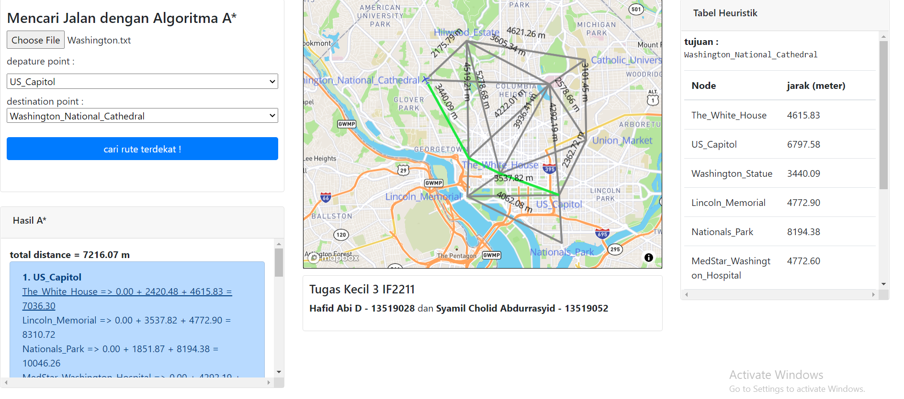

# Project Name
> Pencarian Rute Jarak Terdekat Menggunakan ALgoritma A*

## Table of contents
* [General info](#general-info)
* [Tampilan](#tampilan)
* [Setup dan Penggunaan](#setup-dan-penggunaan)
* [Features](#features)
* [Status](#status)
* [Inspiration](#inspiration)
* [Author](#author)

## General info
Program ini menggunakan kerangka dasar berupa graf. Aplikasi dibuat berbasis web dan disertai maps API dari Mapbox dengan input berupa file text. Project ini merupakan penugasan Tugas Kecil 3 mata kuliah Strategi Algoritma IF2211 semester 2 tahun 2020/2021.

## Tampilan


## Setup dan Penggunaan
Aplikasi ini dibuat dengan bahasa javascript (dan html). Untuk penggunaan, pastikan environment anda bisa menjalankan bahasa tersebut. Mayoritas perangkat seharusnya sudah memiliki kemampuan tersebut (jika anda bisa membuka web, seharusnya sudah bisa).

Cara instalasi dan penggunaannya adalah sebagai berikut :
1. Download file yang tersedia di directory.
2. Buka folder bin.
3. Jalankan file 'index.html', buka dengan web browser. Bisa juga drag file ke tempat link pada web.
4. Klik Choose File untuk memilih file input berformat txt. Sudah tersedia beberapa contoh file input di dalam folder test.
5. Pilih departure point dan destination point.
6. Klik 'cari rute terdekat !' dan aplikasi akan menampilkan jalurnya.
NB : Untuk mengganti file input, refresh website terlebih dahulu

## Code Examples
Format input file text :
```
11
-6.887221 107.611479 Segitiga_Dayang_Sumbi
-6.887825 107.608051 Batan
-6.893890 107.608442 Bonbin
-6.893188 107.610418 Kubus
-6.893731 107.612864 Borromeus
-6.885551 107.611683 CircleK
-6.885098 107.613549 Mcd_Dago
-6.884972 107.611512 Baksil
-6.887387 107.613599 Dago
-6.885175 107.609949 Saraga
-6.890154 107.613099 SPBU_Dago
0 1 0 0 0 1 1 0 1 0 0
1 0 1 0 0 0 0 0 0 0 0
0 1 0 1 0 0 0 0 0 0 0
0 0 1 0 1 0 0 0 0 0 0
0 0 0 1 0 0 0 0 0 0 1
1 0 0 0 0 0 0 1 0 0 0
1 0 0 0 0 0 0 1 1 0 0
0 0 0 0 0 1 1 0 0 1 0
1 0 0 0 0 0 1 0 0 0 1
0 0 0 0 0 0 0 1 0 0 0
0 0 0 0 1 0 0 0 1 0 0
```
Catatan :
- Angka baris pertama merupakan jumlah nodes atau simpul
- Format simpul input berupa latitude longtitude dan nama simpul/tempat
- Angka-angka di bawahnya adalah matriks ketetanggan yang mewakili simpul sesuai urutan di atasnya. Nilai 0 berarti tidak bertetangga dan nilai 1 berarti bertetangga.

## Features
List of features :
* Real-maps API by Mapbox !
* Free input file map All Over The World !


## Status
Project is: _finished_

## Inspiration
- Mapbox API
- Bapak Rinaldi Munir dan websitenya.

## Author
Hafid Abi Daniswara
13519028
Teknik Informatika ITB

Syamil Cholid Abdurrasyid
13519052
Teknik Informatika ITB
